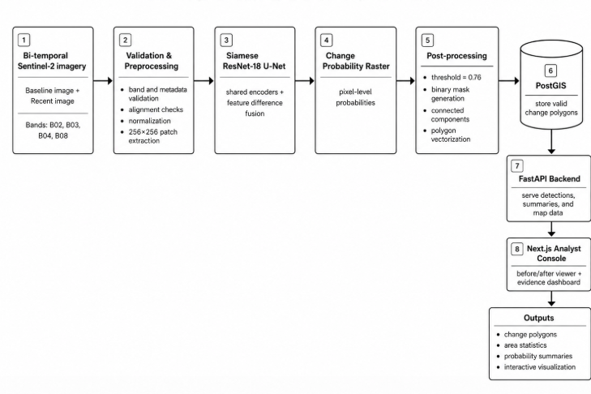
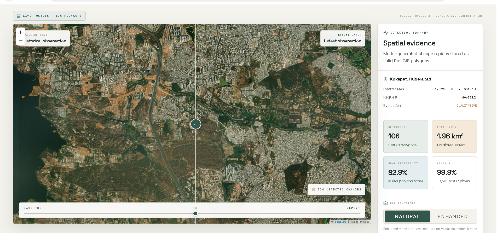
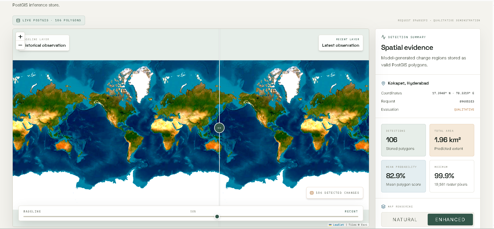

<div align="center">

# GeoWatch

### Satellite Change Detection and Geospatial Visualization Platform

GeoWatch detects geographical changes between historical and recent Sentinel-2 satellite observations and presents model-generated change regions through an interactive web dashboard.

[](https://geowatch-app-825325.onrender.com)
[](https://geowatch-api-825325.onrender.com/health)

</div>

---

## Overview

GeoWatch processes bi-temporal satellite imagery, predicts pixel-level changes, converts detected regions into geospatial polygons, stores them in PostGIS, and displays the results in a Next.js dashboard.

### Key Features

- Bi-temporal satellite image comparison
- Deep learning-based change detection
- Change-probability and binary-mask generation
- Raster-to-polygon conversion
- PostGIS spatial storage
- Interactive before-and-after visualization
- Natural and enhanced image rendering

---

## Live Demo

**Application:** [https://geowatch-app-825325.onrender.com](https://geowatch-app-825325.onrender.com)

**Backend Health:** [https://geowatch-api-825325.onrender.com/health](https://geowatch-api-825325.onrender.com/health)

<p align="center">
  <a href="https://geowatch-app-825325.onrender.com">
    
  </a>
</p>

---

## System Architecture

<p align="center">
  
</p>

```text
Historical and Recent Satellite Images
                    ↓
          Validation and Preprocessing
                    ↓
          Siamese ResNet-18 U-Net
                    ↓
          Change Probability Raster
                    ↓
        Mask and Polygon Generation
                    ↓
                  PostGIS
                    ↓
             FastAPI Backend
                    ↓
          Next.js Web Dashboard
```

---

## Dashboard

The dashboard provides a comparison slider, detected-change polygons, predicted area, probability summaries, and map-rendering controls.

### Natural Rendering

<p align="center">
  
</p>

### Enhanced Rendering

<p align="center">
  
</p>

### Geographic View

<p align="center">
  
</p>

---

## Tech Stack

| Layer | Technologies |
|---|---|
| Machine Learning | Python, PyTorch, ResNet-18, U-Net, ONNX Runtime |
| Geospatial Processing | Rasterio, GeoPandas, Shapely, OpenCV |
| Backend | FastAPI, Pydantic, Uvicorn |
| Database | PostgreSQL, PostGIS |
| Frontend | Next.js, React, TypeScript, Leaflet |
| Infrastructure | Docker, Docker Compose, Render |
| Satellite Data | Sentinel-2 multispectral imagery |

---

## Processing Pipeline

1. Load historical and recent Sentinel-2 images.
2. Validate bands, dimensions, and spatial alignment.
3. Generate pixel-level change probabilities.
4. Apply thresholding and connected-component filtering.
5. Convert detected regions into valid polygons.
6. Store polygons and statistics in PostGIS.
7. Serve the results through FastAPI.
8. Display the results in the Next.js dashboard.

---

## Project Structure

```text
Geo-Watch/
├── README.md
├── geowatch/
│   ├── configs/
│   ├── data/
│   ├── deploy/
│   ├── docs/
│   │   └── assets/
│   │       ├── Artichitecture.png
│   │       ├── Enhanced.png
│   │       ├── Geo-watch_Dashboard.png
│   │       ├── Natural.png
│   │       └── World_view.png
│   ├── experiments/
│   ├── migrations/
│   ├── notebooks/
│   ├── reports/
│   ├── src/
│   └── tests/
└── geowatch-frontend/
```

---

## Responsible Use

GeoWatch detections are model-generated candidate change regions. Results should be reviewed together with the original satellite imagery before making operational decisions.

---

## Author

**Deepika Kumari**

Computer Vision and AI Engineer