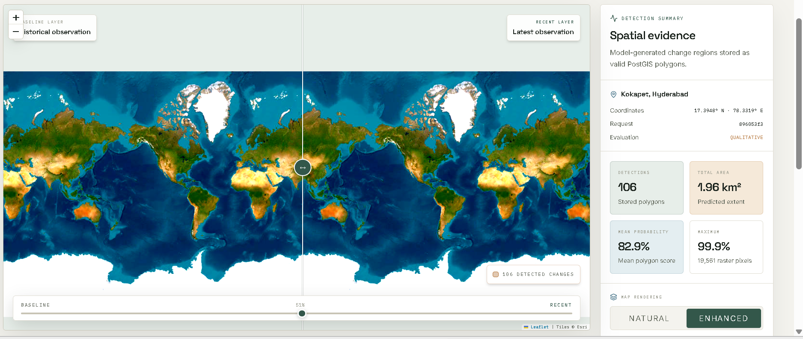
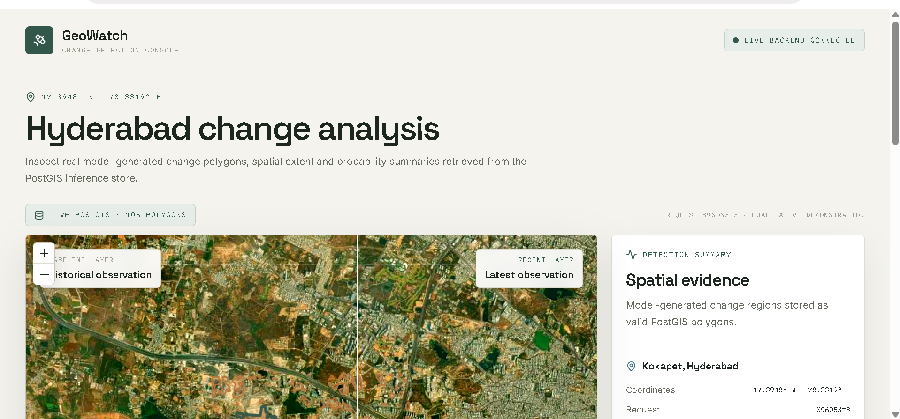
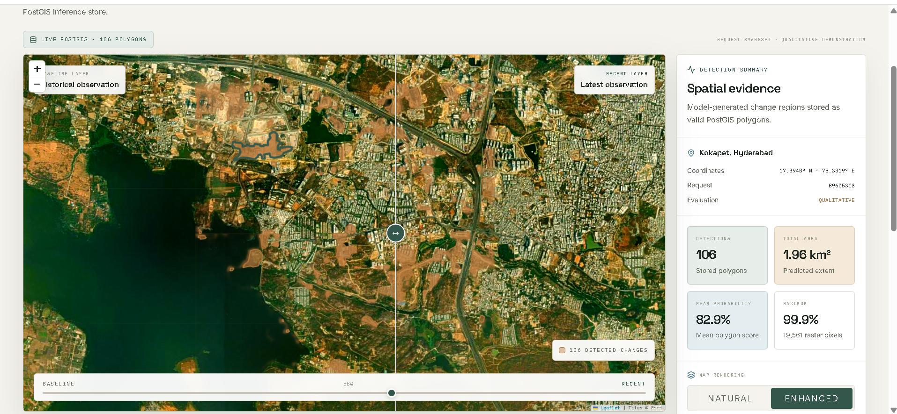

<div align="center">

# GeoWatch

### Satellite Change Detection and Spatial Intelligence Platform

GeoWatch is an end-to-end geospatial computer vision system that identifies, measures, stores, and visualizes changes between bi-temporal satellite observations.

[](https://geowatch-app-825325.onrender.com)
[](https://geowatch-api-825325.onrender.com/health)

<br>


</div>

---

<p align="center">
  <a href="https://geowatch-app-825325.onrender.com">
    
  </a>
</p>

<p align="center">
  <strong>
    <a href="https://geowatch-app-825325.onrender.com">
      Open the Live GeoWatch Application
    </a>
  </strong>
</p>

---

## Overview

GeoWatch converts satellite image pairs into reviewable geospatial evidence.

The platform accepts a historical observation and a recent observation of the same geographical region, applies a deep learning change-detection model, generates pixel-level change probabilities, converts detected regions into valid polygons, stores them in PostGIS, and presents the results through an interactive web application.

Unlike a notebook-only machine learning demonstration, GeoWatch implements the complete workflow from satellite imagery to deployed spatial intelligence.

### GeoWatch pipeline

```text
Bi-temporal satellite imagery
        ↓
Image validation and preprocessing
        ↓
Siamese deep learning model
        ↓
Pixel-level change probability raster
        ↓
Thresholding and binary mask generation
        ↓
Connected-component analysis
        ↓
Polygon vectorization
        ↓
PostGIS spatial persistence
        ↓
FastAPI inference and spatial APIs
        ↓
Next.js analyst dashboard
```

---

## Live Deployment

| Service | Deployment |
|---|---|
| GeoWatch web application | [Open Live Application](https://geowatch-app-825325.onrender.com) |
| Backend health endpoint | [Check Backend Status](https://geowatch-api-825325.onrender.com/health) |
| Demonstration location | Kokapet, Hyderabad |
| Evaluation mode | Qualitative demonstration |

> The hosted service may require a few seconds to start when it has been inactive.

---

## Key Features

- Bi-temporal satellite image comparison
- Multispectral Sentinel-2 image processing
- Deep learning-based pixel-level change detection
- Weight-shared Siamese neural network architecture
- Probability raster generation
- Configurable change-threshold processing
- Binary change-mask generation
- Connected-component filtering
- Raster-to-vector polygon conversion
- Valid geometry storage in PostGIS
- Spatial area and probability aggregation
- FastAPI-based backend services
- ONNX Runtime CPU inference
- Interactive before-and-after image comparison
- Natural and enhanced image-rendering modes
- Model-generated polygon overlays
- Responsive analyst dashboard
- Containerized local infrastructure

---

## System Architecture

<p align="center">
  
</p>

### Architecture stages

| Stage | Component | Responsibility |
|---:|---|---|
| 1 | Satellite input | Loads baseline and recent Sentinel-2 observations |
| 2 | Validation and preprocessing | Validates bands, alignment, dimensions, metadata, and normalization |
| 3 | Siamese model | Extracts temporal features using shared encoders |
| 4 | Probability prediction | Produces a pixel-level change probability raster |
| 5 | Post-processing | Applies thresholding, filtering, and polygon vectorization |
| 6 | PostGIS | Stores valid change polygons and spatial metadata |
| 7 | FastAPI | Serves detections, statistics, imagery, and request information |
| 8 | Next.js | Presents interactive spatial evidence to the analyst |

---

## Model Architecture

GeoWatch uses a **weight-shared Siamese ResNet-18 U-Net** for binary satellite change detection.

Two aligned observations pass through a shared encoder. Their corresponding feature maps are compared using absolute feature differences. A U-Net-style decoder then reconstructs a full-resolution change-probability raster.

### Model input

| Property | Value |
|---|---|
| Observation type | Bi-temporal satellite imagery |
| Input dates | Baseline and recent observation |
| Satellite bands | B02, B03, B04, B08 |
| Number of bands | Four per observation |
| Patch dimensions | 256 × 256 pixels |
| Prediction type | Pixel-level binary change probability |
| Temporal fusion | Absolute feature difference |
| Deployment format | ONNX |
| Deployment runtime | ONNX Runtime CPU Execution Provider |

### Inference workflow

```text
Baseline tensor ──→ Shared ResNet-18 encoder ──┐
                                               ├─→ Feature difference
Recent tensor ────→ Shared ResNet-18 encoder ──┘
                                                        ↓
                                                  U-Net decoder
                                                        ↓
                                            Change-probability raster
                                                        ↓
                                             Thresholded change mask
```

---

## Spatial Post-processing

The raw model output is processed before being stored or displayed.

```text
Probability raster
        ↓
Frozen probability threshold
        ↓
Binary change mask
        ↓
Connected-component extraction
        ↓
Small-region filtering
        ↓
Polygon vectorization
        ↓
Geometry validation
        ↓
PostGIS persistence
```

Each stored detection can include:

- Polygon geometry
- Polygon area
- Mean model probability
- Maximum model probability
- Source request identifier
- Geographic coordinates
- Model and threshold metadata
- Inference timestamps

---

## Application Dashboard

The GeoWatch interface combines satellite comparison, geospatial overlays, and inference summaries in a single analyst-focused view.

<p align="center">
  
</p>

The dashboard provides:

- Historical and recent image labels
- Interactive comparison slider
- Detected polygon overlays
- Detection count
- Total predicted polygon area
- Mean polygon probability
- Maximum probability
- Request metadata
- Geographic coordinates
- Natural and enhanced rendering controls
- Backend connectivity status

---

## Natural and Enhanced Rendering

GeoWatch supports two visualization modes for image inspection.

<table>
  <tr>
    <td width="50%" align="center">
      <strong>Natural Rendering</strong>
    </td>
    <td width="50%" align="center">
      <strong>Enhanced Rendering</strong>
    </td>
  </tr>
  <tr>
    <td width="50%">
      
    </td>
    <td width="50%">
      
    </td>
  </tr>
  <tr>
    <td align="center">
      Preserves a more natural visual appearance for geographic context.
    </td>
    <td align="center">
      Increases contrast to support closer visual inspection of candidate changes.
    </td>
  </tr>
</table>

Rendering controls only modify the visual presentation of imagery. They do not change the stored model predictions or polygon geometries.

---

## Geographic Navigation

The underlying map supports navigation across wider spatial extents while retaining the selected baseline and recent imagery layers.

<p align="center">
  
</p>

The public demonstration is configured for a selected Hyderabad region. The wider map view demonstrates map navigation and layer behaviour rather than global model validation.

---

## Demonstration Evidence

The deployed Kokapet demonstration currently displays the following model-generated values:

| Evidence | Displayed value |
|---|---:|
| Stored change polygons | 106 |
| Predicted polygon extent | 1.96 km² |
| Mean polygon probability | 82.9% |
| Maximum raw probability | 99.9% |
| Location | Kokapet, Hyderabad |
| Coordinates | 17.3948° N, 78.3319° E |

These values demonstrate:

- Successful model inference
- Raster post-processing
- Polygon vectorization
- PostGIS spatial persistence
- Backend aggregation
- Frontend visualization

> These values are qualitative deployment evidence. They should not be interpreted as accuracy measurements because an aligned ground-truth change mask is not available for the deployed Hyderabad image pair.

---

## Technology Stack

### Machine learning and geospatial processing

| Technology | Purpose |
|---|---|
| Python | Core machine learning and geospatial implementation |
| PyTorch | Model development and training |
| torchvision | ResNet-18 feature encoder |
| ONNX | Portable deployment representation |
| ONNX Runtime | CPU inference |
| NumPy | Numerical processing |
| Rasterio | Geospatial raster processing |
| GeoPandas | Geospatial data manipulation |
| Shapely | Polygon construction and validation |
| OpenCV | Image and mask processing |

### Backend and persistence

| Technology | Purpose |
|---|---|
| FastAPI | Inference and spatial REST API |
| Pydantic | Request and response validation |
| PostgreSQL | Relational persistence |
| PostGIS | Geospatial polygon storage and queries |
| SQLAlchemy | Database integration |
| Uvicorn | ASGI application server |

### Frontend and visualization

| Technology | Purpose |
|---|---|
| Next.js | Web application framework |
| React | Interactive interface components |
| TypeScript | Type-safe frontend development |
| Leaflet | Interactive geographic visualization |
| CSS | Responsive dashboard styling |

### Infrastructure

| Technology | Purpose |
|---|---|
| Docker | Reproducible service containers |
| Docker Compose | Local PostGIS orchestration |
| Render | Public application deployment |
| GitHub | Source control and project documentation |

---

## Repository Structure

```text
GEO-WATCH/
├── README.md
│
├── geowatch/
│   ├── artifacts/                   # Generated model and inference artifacts
│   ├── configs/                     # Training and inference configurations
│   ├── data/                        # Dataset indexes and local data references
│   ├── deploy/                      # Docker and deployment configuration
│   │
│   ├── docs/
│   │   ├── assets/
│   │   │   ├── Architecture_Diagram.png
│   │   │   ├── Dashboard.png
│   │   │   ├── Enhanced.png
│   │   │   ├── Geo-Watch_Dashboard.png
│   │   │   └── World_View.png
│   │   ├── datasets/
│   │   ├── backend-postgis-runbook.md
│   │   └── week1_data_pipeline_summary.md
│   │
│   ├── experiments/                 # Training and ablation experiments
│   ├── migrations/                  # Database migrations
│   ├── notebooks/                   # Exploratory notebooks
│   ├── reports/                     # Evaluation and deployment reports
│   ├── scripts/                     # CLI utilities and pipelines
│   ├── src/                         # Production Python source code
│   └── tests/                       # Automated tests
│
└── geowatch-frontend/               # Next.js web application
```

---

## Local Development

### Prerequisites

Install the following before starting the project:

- Python 3.11 or later
- Node.js 20 or later
- Docker Desktop
- Git
- PostgreSQL client tools, if required
- PowerShell or a compatible terminal

---

## Start PostGIS

From the repository root:

```powershell
Set-Location ".\geowatch"

docker compose `
  -f ".\deploy\docker-compose.local.yml" `
  up -d
```

Verify the running services:

```powershell
docker compose `
  -f ".\deploy\docker-compose.local.yml" `
  ps
```

---

## Start the Backend

```powershell
Set-Location ".\geowatch"

& ".\.venv\Scripts\Activate.ps1"
```

Configure the inference environment:

```powershell
$env:MODEL_BACKEND = "onnx_cpu"
$env:GEOWATCH_DEVICE = "cpu"
```

Start FastAPI:

```powershell
uvicorn src.backend.main:app `
  --host 0.0.0.0 `
  --port 8007 `
  --reload
```

Backend API:

```text
http://127.0.0.1:8007
```

API documentation:

```text
http://127.0.0.1:8007/docs
```

Health endpoint:

```text
http://127.0.0.1:8007/health
```

---

## Start the Frontend

Open a second terminal:

```powershell
Set-Location ".\geowatch-frontend"

npm install
```

Configure the backend origin:

```powershell
$env:GEOWATCH_API_ORIGIN = "http://127.0.0.1:8007"
```

Start the Next.js development server:

```powershell
npm run dev
```

Open the application:

```text
http://localhost:3000
```

---

## Environment Configuration

Create the required environment configuration using your project's environment template.

Example backend variables:

```env
MODEL_BACKEND=onnx_cpu
GEOWATCH_DEVICE=cpu

DATABASE_HOST=localhost
DATABASE_PORT=5432
DATABASE_NAME=geowatch
DATABASE_USER=geowatch
DATABASE_PASSWORD=replace_with_secure_password
```

Example frontend variables:

```env
GEOWATCH_API_ORIGIN=http://127.0.0.1:8007
NEXT_PUBLIC_GEOWATCH_API_ORIGIN=http://127.0.0.1:8007
```

Do not commit production credentials, database passwords, private imagery URLs, or secret keys.

---

## Testing

Run the backend test suite from the `geowatch` directory:

```powershell
python -m pytest tests -q
```

Run Python compilation checks:

```powershell
python -m compileall -q src tests
```

Verify installed dependencies:

```powershell
python -m pip check
```

Run frontend checks:

```powershell
Set-Location "..\geowatch-frontend"

npm run lint
npm run build
```

---

## API Responsibilities

The FastAPI backend is responsible for:

- Health and readiness reporting
- Model initialization
- ONNX inference
- Request validation
- Spatial detection retrieval
- Polygon serialization
- Area aggregation
- Probability summaries
- Baseline and recent imagery metadata
- Frontend-ready map responses

Example API workflow:

```text
Frontend request
      ↓
FastAPI endpoint
      ↓
PostGIS spatial query
      ↓
Detection and summary response
      ↓
Leaflet polygon rendering
```

---

## Design Decisions

### Why a Siamese network?

A shared encoder processes both observations using the same feature extractor. This reduces parameter duplication and encourages comparable feature representations across time.

### Why use absolute feature differences?

Absolute difference fusion highlights temporal changes without depending on which observation appears first.

### Why store polygons instead of only masks?

Polygons can be:

- Rendered efficiently on interactive maps
- Queried using spatial database operations
- Measured in geographic units
- Exported to standard GIS formats
- Associated with confidence and provenance metadata

### Why use PostGIS?

PostGIS provides reliable geospatial storage and supports:

- Geometry validation
- Spatial indexing
- Intersection queries
- Area calculation
- Bounding-box filtering
- Geographic data interoperability

### Why export to ONNX?

ONNX separates deployment inference from the training framework and supports efficient CPU-based model serving.

---

## Limitations

GeoWatch currently has the following limitations:

- The deployed Hyderabad scene does not have an aligned ground-truth change mask.
- Model probabilities are raw outputs and are not calibrated correctness guarantees.
- Detected polygons represent candidate change regions, not independently verified events.
- Image registration errors may create false edge changes.
- Seasonal vegetation variation can produce false positives.
- Clouds, haze, shadows, moisture, and illumination differences may affect predictions.
- Sentinel-2 spatial resolution limits the detection of very small structures.
- Model performance can vary substantially between geographic regions.
- The system has not been validated for safety-critical or legally consequential use.
- The current deployment demonstrates serveability, not global real-time monitoring.

---

## Responsible Use

GeoWatch should be used as an analyst-support system.

The generated polygons must not be used independently to infer:

- Ownership
- Intent
- Legality
- Responsibility
- Population behaviour
- Emergency severity

Operational decisions should combine model outputs with source imagery, acquisition metadata, local context, domain expertise, and human review.

---

## Future Improvements

Planned improvements include:

- Cloud and shadow masking
- Automatic image co-registration
- Calibrated uncertainty estimates
- Region-level confidence scoring
- Improved small-object detection
- Multi-scale feature fusion
- Additional multispectral bands
- Transformer-based change-detection models
- Cross-geography domain adaptation
- Batch inference workflows
- GeoJSON and Shapefile export
- User-defined region-of-interest analysis
- Historical request management
- Model-version tracking
- Per-polygon analyst feedback
- Continuous monitoring workflows

---

## Project Positioning

> GeoWatch is a production-oriented geospatial computer vision project that combines multispectral satellite change detection, ONNX model serving, geospatial post-processing, PostGIS persistence, FastAPI services, and an interactive Next.js analyst console.

The project demonstrates competencies across:

- Computer vision
- Deep learning
- Geospatial machine learning
- Raster and vector data processing
- Model deployment
- Backend engineering
- Spatial databases
- Frontend visualization
- MLOps
- Responsible AI evaluation

---

## Acknowledgements

GeoWatch uses Sentinel-2 multispectral imagery and established satellite change-detection practices for model development, experimentation, and evaluation.

---

<div align="center">

### Explore GeoWatch

[Open Live Application](https://geowatch-app-825325.onrender.com)
&nbsp;&nbsp;•&nbsp;&nbsp;
[Check Backend Health](https://geowatch-api-825325.onrender.com/health)

<br><br>

Built as an end-to-end geospatial computer vision and deployment project.

</div>